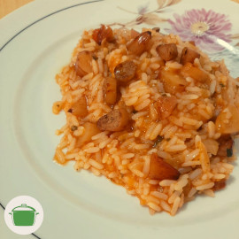

# Carreteiro de pinhão

Uma única panela. Receita tradicional gaúcha, mas muito mais gostosa com pinhão!  <i class="fas fa-seedling"></i>

## Ingredientes

* 350gr de [pinhão cozido](pinhao_cozido.md) descascado
* 1 cebola pequena
* 3 dentes de alho
* 1 pimenta dedo de moça <i class="fas fa-pepper-hot"></i>
* 3 tomates italianos
* 1 colher de chá cheia de páprica defumada
* 1 colher de sopa de molho inglês
* 1 xícara de arroz

## Modo de preparo

1. Pique o pinhão em rodelas grossas.
2. Em uma panela média, coloque uma colher de óleo vegetal e frite o pinhão em fogo médio. Coloque uma colher de chá de sal (a gosto). Mexa com frequência.
3. No que o pinhão começar a ficar crocante, adicione o molho inglês e frite até o pinhão ficar crocante por fora e macio por dentro.
4. Reserve essa delícia! Não se preocupe, a receita já está com 50gr a mais de pinhão para você "experimentar" enquanto termina o prato! <i class="fas fa-laugh-wink"></i>
5. Retirado o pinhão, adicione uma colher de óleo vegetal na panela.
6. Refogue a cebola picada em fogo alto. Em seguida, adicione o alho e a pimenta para refogar em fogo médio.
7. No que o alho ficar dourado, adicione os tomates descascados e picados.
8. Adicione a páprica defumada e o sal a gosto.
8. Cozinhe em fogo baixo e com a panela semiaberta até a base de molho de tomate ficar a seu gosto. Mexa com frequência. 
9. Base do molho pronto? Adicione o arroz e duas xícaras de água.
10. Cozinhe o arroz mexendo com frequência até ficar no ponto a seu gosto. Corrija o sal (a gosto). Se necessário, acrescente água aos poucos.
11. O arroz está ao ponto? Adicione o pinhão, mexa e ... sirva! <i class="fas fa-laugh-wink"></i>

## Observações

* Tempo de preparo: 1 hora.

* No molho, fique a vontade para adicionar temperinhos maravilhosos como sálvia, [erva baleeira](https://pt.wikipedia.org/wiki/Cordia_verbenacea), etc.

* Tem [ora-pro-nóbis](https://pt.wikipedia.org/wiki/Pereskia_aculeata)? Adicione picada junto com o arroz.  <i class="fas fa-seedling"></i> 

* Sirva com temperinho verde ou coentro picado fresco.

## Rendimento

Serve 4 pratos.
