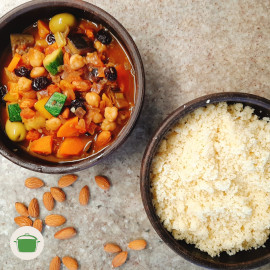

<iframe src="https://archive.org/embed/couscous_com_legumes" width="270" height="30" frameborder="0" webkitallowfullscreen="true" mozallowfullscreen="true" allowfullscreen></iframe>

# Couscous com legumes - inspirado em tahine

Inspirado em tahine, nosso couscous com legumes! <i class="fas fa-laugh"></i>

## Ingredientes

* 1 e 1/2 xícara de couscous.
* 2 tomates.
* 1 cebola.
* 1/2 berinjela picada em pedaços médios. 
* 1/2 abobrinha picada em pedaços médios. 
* 1 cenoura pequena picada em pedaços médios. 
* 1/2 xícara de de grão-de-bico cozido.
* 1/2 alho poró cortado em rodelas.
* 1/4 de xícara de pimentão amarelo picado. 
* 1 pimenta dedo de moça. <i class="fas fa-pepper-hot"></i>
* 5 damascos secos.
* 3 tâmaras.
* 1 punhado de amêndoa **in natura**. 
* 2 colher de sopa **ras el hanout**.
* 2 cravos.
* 6 azeitonas verdes.

## Modo de preparo

1. Em uma panela, refogue a cebola e a pimenta picadas. No que a cebola começar a dourar, acrescente os tomates picados e o cravo. Cozinhe até formar uma molho de base. Adicione sal e temperos a gosto.
2. Em uma frigideira alta, coloque um fio de óleo vegetal e doure a cenoura picada e o alho poró picado. Reserve. 
3. Na frigideira, adicione a abobrinha e a berinjela cortadas em pedaços médios. Adicione o pimentão cortado em pedaços pequenos e o grão de pico. Adicione um fio de óleo vegetal e leve ao fogo para dourar.
4. Adicione  os legumes dourados ao molho de tomate, acrescente um pouco de água, as frutas secas e as azeitonas. Deixe cozinhar por 5 minutos. 
5. Enquanto isso, prepare o couscous conforme as instruções da fabricante.
6. Sirva. <i class="fas fa-hand-spock"></i>

## Observações

* **Ras el hanout** é um tipo de curry a base de coentro, curcuma, cominho, pimenta do reino, pimenta, cardamomo e mostarda. <i class="fas fa-laugh-wink"></i> 

## Rendimento

Serve 4 pratos.
