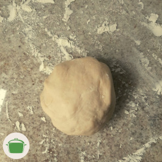
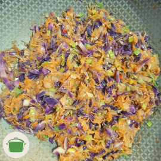

# Guioza de legumes

Guiozas recheados com legumes.

## Ingredientes

### Massa

* 1 e 1/2 xícara de farinha de trigo
* 1/2 xícara de água morna
* 1 colher de chá de sal (a gosto)

### Recheio

* 1/4 xícara de cebola picada
* 1 xícara de cenoura ralada
* 1 colher de chá de gengibre picado
* 1 dente de alho picado
* 3/4 xícara de alho poró picado
* 1 pimenta dedo-de-moça
* 1 xícara de batata ralada
* 2 xícaras de repolho roxo picado
* 1 colher de chá de sal (a gosto)
* 1 colher de chá de amido de milho
* 1/4 xícara de água
* 1 colher de chá de óleo de gergelim
* 1 colher de sopa de óleo vegetal

### Preparo dos guiozas recheados

* 1/4 xícara de óleo vegetal
* 500ml de água

### Molho (opcional)

* 1 limão
* 2 colheres de sopa de molho de soja
* 1 colher de chá de óleo de gergelim
* 1 colher de sopa cheia de temperinho verde picado

## Modo de preparar

### Massa

1. Coloque a farinha e o sal em uma tigela e misture.
2. Acrescente água aos poucos e amasse com a mão até ficar uma massa uniforme.
3. Reserve por 30 minutos.

### Recheio

1. Preaqueça os óleos em uma frigideira alta em fogo baixo.
2. Acrescente cebola e refogue até ficar levemente dourada.
3. Acrescente o alho, a pimenta e o gengibre. Refogue até dourar.
4. Acrescente o alho poró, a cenoura, o repolho, a batata e refogue até o repolho murchar.
5. Em um copo, misture o amido de milho com a água até formar um líquido uniforme.
6. Acrescente a mistura com os legumes na frigideira e refogue até engrossar.
7. Reserve.

### Preparo dos guiozas recheados

1. Abra a massa com rolo até ficar bem fina.
2. Corte a massa em discos de 10cm cada. Pode usar a boca de uma xícara grande ou um pires pequeno, etc..
3. Abra cada disco de massa mais uma vez, de forma a deixá-los bem finos. Esforce-se! <i class="fas fa-laugh"></i>
4. Recheie cada disco de massa e feche em formato de pastel com dobras. Veja um vídeo no YouTube! :D
5. Em uma frigideira antiaderente, preaqueça 1 colher de sopa do óleo vegetal em fogo baixo.
2. Acrescente em torno de quatro a seis guiozas e frite sem mexer até dourar um dos lados.
3. Adicione em torno de 1/4 de xícara de água, tampe a frigideira e cozinhe até a massa ficar translúcida.
4. Reserve as guiozas para servir e repita o processo com as outras.

### Molho (opcional)

1. Em uma tigela, esprema o suco do limão.
2. Acrescente os demais ingredientes e misture.

## Observação

Fique a vontade para improvisar no recheio! <i class="fas fa-smile-wink"></i> 

## Rendimento

Rende em torno de 20 guiozas. Esforçou-se? Então, rende mais de 25! <i class="fas fa-laugh"></i>

