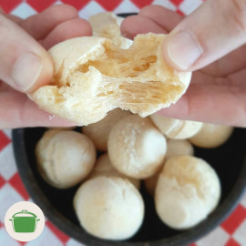

# Pão de quê

## Ingredientes

* 1 xícara de inhame
* 1 xícara de polvilho doce
* 1 xícara de polvilho azedo
* 1 colher de chá de colorau
* 1/4 xícara de óleo 
* 1 colher de chá de sal (a gosto)

## Modo de preparo

1. Cozinhe o inhame descascado.
2. Coloque o inhame em uma vasilha e amasse até formar um purê. Reserve a água do cozimento (+/- 1/2 xícara de água).
3. Adicione os outros ingredientes (menos a água).
4. Amasse com a mão e vá adicionando a água do cozimento aos poucos, até ficar uma massa macia e uniforme.
5. Faça bolinhas pequenas da massa (máximo do tamanho de uma bola de pingue-pongue).
6. Coloque para assar no forno a 180°C em uma forma antiaderente ou bezuntada. Disponha as bolinhas um pouco separadas uma das outras (elas vão quase dobrar de tamanho).

### Observação

Leva em torno de 40 minutos assando. Vai estar pronto quando as bolinhas crescerem e tiverem uma rachadura.

### Rendimento

Serve quatro pessoas.

## Licença

Este obra está licenciado com uma Licença [Creative Commons Atribuição-CompartilhaIgual 4.0 Internacional](http://creativecommons.org/licenses/by-sa/4.0/).
