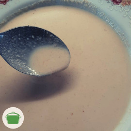
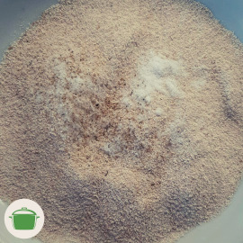

# Preparo para empanar

Preparo para empanar o que você quiser. Só não vale empanar bichinhos, eihn! <i class="fas fa-seedling"></i> <i class="fas fa-smile-wink"></i> 

O preparo consiste no **creme** e na **farinha para empanar**. Siga as receitas abaixo e reserve-as em tigelas separadas. Escolha o que quiser empanar, passe na farinha e após no creme. Fica mais gostoso empanar duas vezes! Leve o empanado ao forno em fogo médio até ficar crocante.

## Creme para empanar

### Ingredientes

* 1 xícara de castanha de caju
* 1/2 limão
* 1 colher de chá de páprica defumada
* 1 colher de chá de sal (a gosto)
* 1 xícara de água

### Modo de preparo

1. Adicione a castanha de caju, a páprica defumada, o sal e algumas gotas de limão (a gosto) no liquidificador.
2. Adicione água até cobrir os ingredientes com uns dois dedos acima. 
3. Bata até ficar um creme homogêneo.
4. Reserve em uma tigela rasa.

### Rendimento

250ml de creme.

## Farinha para empanar

### Ingredientes

* 1 xícara de farinha de mandioca
* 1 colher de chá de sal (a gosto)
* 1 pitada de pimenta do reino moída (a gosto)

### Modo de preparo
 
Adicione todos os ingredientes em uma tigela rasa. Misture e reserve.

### Rendimento

1 xícara de farinha para empanar.

## Observação

Você pode adicionar, a gosto, outros temperos ou ervas no creme ou na farinha para empanar. Vale inclusive estes esquemas super nutritivos, tipo chia! <i class="fas fa-laugh"></i>
