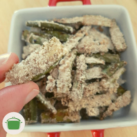

<iframe src="https://archive.org/embed/quiabo_crocante" width="270" height="30" frameborder="0" webkitallowfullscreen="true" mozallowfullscreen="true" allowfullscreen></iframe>

# Quiabo crocante

Filetes crocantes de quiabo que fazem a gente babar! <i class="fas fa-laugh-wink"></i> 

## Ingredientes

* 500 gramas de quiabo.
* 1 xícara de farinha de mandioca.
* 1 colher de chá cheia de sal (a gosto).
* 1 colher de chá de pimenta do reino.
* 1 colher de sopa de óleo vegetal.

## Modo de preparo

1. Corte os quiabos em quatro partes, uma vez ao meio na transversal e depois na horizontal. Corte fora as cabeças dos quiabos.
2. Coloque os quiabos em uma bacia e adicione os demais ingredientes. Mexa até a farinha fixar-se nos quiabos.
3. Em uma forma baixa besuntada, disponha os quiabos separados e com a casca para baixo.
4. Leve ao forno à temperatura alta (280°C). Asse por cerca de 30 minutos até ficar crocante.
5. Sirva. <i class="fas fa-laugh"></i>

## Observações

* Tempo de preparo: 45 minutos.

## Rendimento

Rende uma tigela média cheia.
