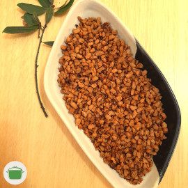

<iframe src="https://archive.org/embed/soja_moida_delicia" width="270" height="30" frameborder="0" webkitallowfullscreen="true" mozallowfullscreen="true" allowfullscreen></iframe>

# Soja moída delícia

Soja miúda refogada com ervilhas frescas! <i class="fas fa-grin-stars"></i>

## Ingredientes

* 200 gramas de soja miúda.
* 1/2 xícada de ervilha _in natura_ (ou congelada).
* 1 cebola pequena.
* 2 dentes de alho.
* 1 pimenta dedo de moça. <i class="fas fa-pepper-hot"></i>
* 2 colheres de sopa de molho de soja.
* 1 colher de chá de páprica defumada.
* 1/2 limão.
* 2 colheres de sopa de vinagre branco.
* 1 colher de chá cheia de sal (a gosto).

## Modo de preparo

1. Coloque a soja de molho em água quente com o vinagre. A água deve cobrir a soja. Tempo de molho, 30 minutos.
2. Lave a soja: adicione água limpa e escorra a água espremendo com as mãos a soja por cerca 3 vezes. Ao final a soja deve ser reservada o mais seca possível.
3. Em uma frigideira alta, refogue a cebola picada. No que a cebola começar a dourar, adicione o alho picado e a pimenta picada para refogar. Refogue até dourar.
4. Reserve o refogado.
5. Na frigideira, refogue a soja com duas colheres de sopa de óleo vegetal.
6. Adicione o molho de soja, a páprica defumada e o limão espremido. Adicione o sal a gosto.
7. Refogue até a soja ficar crocante e, então, adicione o refogado de cebola, alho e pimenta.
8. Adicione a ervilha e refogue por mais três minutos.
9. Sirva. <i class="fas fa-hand-spock"></i>

## Observações

* Tempo de preparo: 50 minutos.

* No refogado, fique a vontade para adicionar temperinhos maravilhosos a seu gosto como: [sálvia](https://pt.wikipedia.org/wiki/Salvia_officinalis), [erva baleeira](https://pt.wikipedia.org/wiki/Cordia_verbenacea), [levístico](https://pt.wikipedia.org/wiki/Lev%C3%ADstico), [alecrim](https://pt.wikipedia.org/wiki/Alecrim), etc.

* Dica: consulte nossa receita de [massa à bolonhesa de soja](./massa_a_bolonhesa_de_soja.md)

## Rendimento

Serve até 4 porções.
