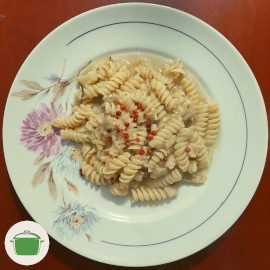

# Massa à berinjela cremosa

Massa à berinjela defumada e cremosa.

## Ingredientes

* 400gr de berinjela
* 3 dentes de alho
* 1 pimenta dedo de moça <i class="fas fa-pepper-hot"></i>
* 1 pitada de alecrim
* 1 colher de sopa de tahine
* 250gr de massa sem ovos  <i class="fas fa-seedling"></i>
* 1 colher de chá de sal (a gosto)

## Modo de preparo

1. Leve cada berinjela diretamente a uma boca de fogão em fogo baixo.
2. Vá virando de tempo em tempo de forma a tostar uniformemente a casca das berinjelas. 
3. Toste a casca até ficar completamente torrada e as berinjelas ficarem bem macias. Que cheiro gostoso! <i class="fas fa-laugh"></i>
4. Retire do fogo, remova a casca das berinjelas e amasse com um garfo. Reserve.
5. Em uma frigideira alta, refogue o alho picado, a pimenta picada e o alecrim.
6. Adicione a berinjela, o tahine e o sal, refogue em fogo baixo por 5 minutos.
6. Prepare a massa conforme as instruções da fabricante. _Al dente_ é mais gostosa! <i class="fas fa-smile-wink"></i>
7. Adicione a massa na frigideira junto com uma concha da água do seu cozimento. Misture e refoge em fogo alto por um instante.
8. Sirva.

## Observações

* Tempo de preparo: 1 hora.

* Pode ser servido com massa espaguete, penne, fusilli, pappardelle, farfalle, etc.

* Ao servir, considere colocar um fio de azeite, pimenta rosa ou do reino, castanha do pará ralada.

* Dica! Durante o preparo da berinjela, proteja o fogão com papel alumínio e limpe antes de esfriar. <i class="fas fa-meh-rolling-eyes"></i>

## Rendimento

Serve duas pessoas.
